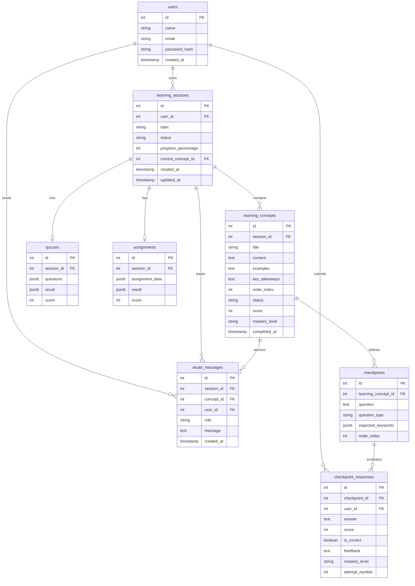
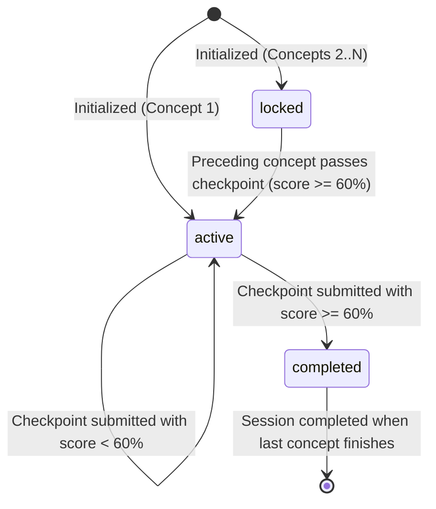

# ConceptFlow AI — Backend Architecture & System Design

## 1. Executive Summary & Core Philosophy

**ConceptFlow AI is NOT a standard chatbot.**

Standard generative AI chat applications follow an unconstrained single-prompt pattern:
`User Prompt → Large LLM Answer → Chat Transcript`.

In contrast, ConceptFlow decomposes any technical topic into a **persistent, structured learning path** governed by a state machine in PostgreSQL:

```
                  USER TOPIC ("Binary Search")
                              ↓
                  STRUCTURED LEARNING PATH
                              ↓
              ┌───────────────────────────────┐
              │  Concept 1: Searching Basics  │ ← ACTIVE (First concept)
              │  - Explanation / Key Takeaways│
              │  - Code & Examples            │
              │  - Checkpoint Questions       │
              └───────────────┬───────────────┘
                              ↓
                     Submit Answer to Checkpoint
                              ↓
                     Backend Evaluation (Score)
                              ↓
                     Score >= PASS_SCORE (60%)?
                     ├─ NO  → Concept remains ACTIVE, feedback returned
                     └─ YES → Mark Concept 1 COMPLETED
                              Unlock Concept 2 (LOCKED → ACTIVE)
                              ↓
              ┌───────────────────────────────┐
              │  Concept 2: Intuition & Halv. │ ← ACTIVE
              │  ...                          │
              └───────────────────────────────┘
```

When a learner has a doubt:
```
              CURRENT CONCEPT (e.g. Concept 2)
                              ↓
              CONTEXTUAL DOUBT ("Why eliminate half?")
                              ↓
                 AI Tutor / Prebuilt Context
                              ↓
              CONTEXTUAL ANSWER (Grounded in Concept 2)
```
**Critical Invariant:** Asking doubts never alters the learning state machine (progress, completion, or locking).

---

## 2. PostgreSQL as the Single Source of Truth

The AI model is an intelligence engine; **it does not store state**. PostgreSQL tracks:
- User identities and hashed credentials
- Session status and aggregate completion percentages
- Active concept pointer (`current_concept_id`)
- Concept progression (`locked`, `active`, `completed`)
- Checkpoints and student response history (with scores and feedback)
- Contextual doubt message history
- Session quizzes and assignments

### Entity-Relationship Diagram



---

## 3. Concept State Lifecycle & Progression

Each concept exists in one of three mutually exclusive states:

1. **`locked`**:
   - The learner cannot access the concept body or submit checkpoint answers.
   - Any attempt to access returns `403 Forbidden` (`code: CONCEPT_LOCKED`).
2. **`active`**:
   - The learner can view full content, ask contextual doubts, and submit answers to checkpoints.
   - There is at most one active concept per session at any time.
3. **`completed`**:
   - The learner has passed the checkpoint criteria (score >= `PASS_SCORE`, default 60).
   - Concept is preserved for review. The next concept in sequential order transitions from `locked` to `active`.



---

## 4. Checkpoint Evaluation & Scoring Architecture

ConceptFlow decouples evaluation logic from state management:
1. **Answer Intake**: Answer is validated for minimum substantive content.
2. **Evaluation Strategy**:
   - **Prebuilt Topics (e.g., Binary Search)**: Fast, deterministic evaluation based on key semantic concepts, keyword groups, and model answers. Operates with zero internet connectivity and zero external API dependencies.
   - **AI-Powered Topics**: Evaluated against concept content using OpenRouter LLM, returning structured JSON scores (0–100), boolean correctness, and tailored feedback.
   - **Graceful Fallback**: If external AI times out or is unreachable, the system automatically falls back to keyword-group matching.
3. **State Transition**: The backend determines whether the score meets `CHECKPOINT_PASS_SCORE`. Only the backend executes the database transaction to unlock subsequent concepts.

### Scoring Rubric & Mastery Thresholds

| Score Range | Mastery Level | Outcome |
| :--- | :--- | :--- |
| **80 – 100** | Strong Understanding | Concept Completed, Next Unlocked |
| **60 – 79** | Good Understanding | Concept Completed, Next Unlocked |
| **40 – 59** | Developing | Concept Remains Active, Guidance Offered |
| **0 – 39** | Needs Improvement | Concept Remains Active, Revision Prompted |

---

## 5. Contextual Doubt Engine

When asking a question via the tutor drawer:
1. The student is anchored to an exact `conceptId`.
2. The backend extracts:
   - Topic title
   - Current concept title and full explanation text
   - Student's question
3. The AI or deterministic tutor responds strictly within the context of that concept.
4. The Q&A exchange is recorded in `doubt_messages`.
5. **No learning state mutation**: The query does NOT alter scores, active status, completion timestamps, or session progress.

---

## 6. Security & Multi-Tenant Data Isolation

ConceptFlow implements multi-layer defense:
1. **JWT Authentication**: Secure HTTP-only cookies and `Authorization: Bearer <token>` support.
2. **Ownership Verification Chain**: Every endpoint verifies that:
   - `learning_sessions.user_id === req.user.id`
   - `learning_concepts.session_id === session.id`
   - `checkpoints.learning_concept_id === concept.id`
   - Cross-user access returns `404 Not Found` or `403 Forbidden`.
3. **Transaction Isolation**: Multi-step operations (e.g. creating sessions with concepts and checkpoints, or unlocking next concepts) execute within PostgreSQL `BEGIN ... COMMIT` blocks with automatic `ROLLBACK` on errors.
4. **Input Validation**: Centralized validation schemas (Zod and custom rules) guard against oversized payloads and malformed structures.
